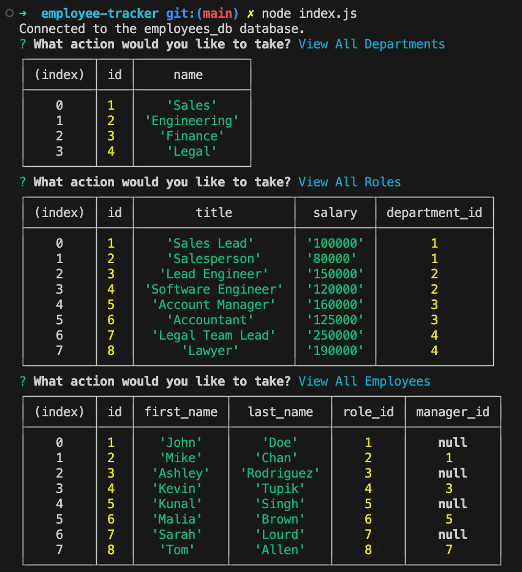

# Employee Tracker

## Description

This project allows the user to view and update a database that tracks employee data such as departments, roles, etc. I got great exposure to the following principles:

-Using MySQL to manipulate data within databases 
-Taking user input and converting it to SQL data with db query 
-Creating seed data as templates for default state and testing. 

## Installation

This can only be run in the integrated terminal using the command: node index.js 

## Usage

Upon running the application, you will be prompted with a menu that will allow you to select between view and edit options. Select the option using the arrow keys on your keyboard. When selecting an Add option, each subsequent menu will prompt the user for input which will then be inserted into the database.

[View the video walkthrough at the following link](https://drive.google.com/file/d/19HcxwYZUR5o1tSLiyD3yBbGOlBlH2Hu2/view)

## Credits

SMU Coding Bootcamp 